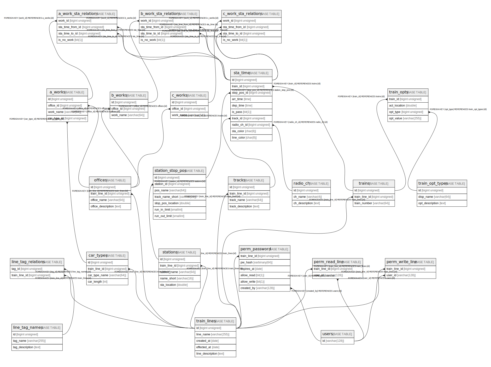

# WebMON Database

## Description

A database that stores each WebMON data.  For authentication functionary, it is expected that an external IDaaS to be used, such as Firebase Authentication.

## Tables

| # | Name | Columns | Comment | Type |
| - | ---- | ------- | ------- | ---- |
| 1 | [a_work_sta_relations](a_work_sta_relations.md) | 4 | relation between work and stoppings | BASE TABLE |
| 2 | [a_works](a_works.md) | 4 | A work (car works) | BASE TABLE |
| 3 | [b_work_sta_relations](b_work_sta_relations.md) | 4 | relation between work and stoppings | BASE TABLE |
| 4 | [b_works](b_works.md) | 3 | B work (driver works) | BASE TABLE |
| 5 | [c_work_sta_relations](c_work_sta_relations.md) | 4 | relation between work and stoppings | BASE TABLE |
| 6 | [c_works](c_works.md) | 3 | C work (conductor works) | BASE TABLE |
| 7 | [car_types](car_types.md) | 4 | car types (e.g. Series 0 with 16 car length) | BASE TABLE |
| 8 | [line_tag_names](line_tag_names.md) | 3 | line tag name and descriptions | BASE TABLE |
| 9 | [line_tag_relations](line_tag_relations.md) | 2 | relations between line and tag | BASE TABLE |
| 10 | [offices](offices.md) | 4 | train/work etc. office informations | BASE TABLE |
| 11 | [perm_password](perm_password.md) | 6 | hashed password list for adding new accessible users | BASE TABLE |
| 12 | [perm_read_line](perm_read_line.md) | 2 | access allow users list | BASE TABLE |
| 13 | [perm_write_line](perm_write_line.md) | 2 | access allow users list | BASE TABLE |
| 14 | [radio_ch](radio_ch.md) | 3 | Radio channel settings | BASE TABLE |
| 15 | [sta_time](sta_time.md) | 10 | station arrive/departure time etc. | BASE TABLE |
| 16 | [station_stop_pos](station_stop_pos.md) | 7 | stop position of each station | BASE TABLE |
| 17 | [stations](stations.md) | 5 | station information | BASE TABLE |
| 18 | [tracks](tracks.md) | 4 | track information (between each stations) | BASE TABLE |
| 19 | [train_lines](train_lines.md) | 5 | railroad line data | BASE TABLE |
| 20 | [train_opt_types](train_opt_types.md) | 3 | option types for train data | BASE TABLE |
| 21 | [train_opts](train_opts.md) | 4 | options for train data | BASE TABLE |
| 22 | [trains](trains.md) | 3 | train data | BASE TABLE |
| 23 | [users](users.md) | 1 | Records User IDs (uid) created by Firebase Authentication | BASE TABLE |

## Relations

---

> Generated by [tbls](https://github.com/k1LoW/tbls)
