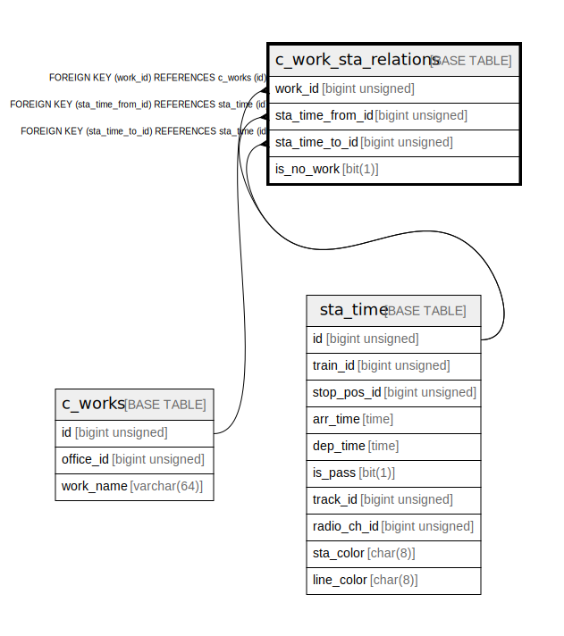

# c_work_sta_relations

## Description

relation between work and stoppings

<details>
<summary><strong>Table Definition</strong></summary>

```sql
CREATE TABLE `c_work_sta_relations` (
  `work_id` bigint unsigned NOT NULL COMMENT 'target work id',
  `sta_time_from_id` bigint unsigned NOT NULL COMMENT 'target origin station arrive/departure time record id',
  `sta_time_to_id` bigint unsigned NOT NULL COMMENT 'target destination station arrive/departure time record id',
  `is_no_work` bit(1) NOT NULL COMMENT 'whether the work is phoresis',
  PRIMARY KEY (`work_id`,`sta_time_from_id`),
  KEY `sta_time_from_id` (`sta_time_from_id`),
  KEY `sta_time_to_id` (`sta_time_to_id`),
  CONSTRAINT `c_work_sta_relations_ibfk_1` FOREIGN KEY (`work_id`) REFERENCES `c_works` (`id`) ON DELETE CASCADE,
  CONSTRAINT `c_work_sta_relations_ibfk_2` FOREIGN KEY (`sta_time_from_id`) REFERENCES `sta_time` (`id`),
  CONSTRAINT `c_work_sta_relations_ibfk_3` FOREIGN KEY (`sta_time_to_id`) REFERENCES `sta_time` (`id`)
) ENGINE=InnoDB DEFAULT CHARSET=utf8mb4 COLLATE=utf8mb4_0900_ai_ci COMMENT='relation between work and stoppings'
```

</details>

## Columns

| # | Name | Type | Default | Nullable | Children | Parents | Comment |
| - | ---- | ---- | ------- | -------- | -------- | ------- | ------- |
| 1 | work_id | bigint unsigned |  | false |  | [c_works](c_works.md) | target work id |
| 2 | sta_time_from_id | bigint unsigned |  | false |  | [sta_time](sta_time.md) | target origin station arrive/departure time record id |
| 3 | sta_time_to_id | bigint unsigned |  | false |  | [sta_time](sta_time.md) | target destination station arrive/departure time record id |
| 4 | is_no_work | bit(1) |  | false |  |  | whether the work is phoresis |

## Constraints

| # | Name | Type | Definition |
| - | ---- | ---- | ---------- |
| 1 | c_work_sta_relations_ibfk_1 | FOREIGN KEY | FOREIGN KEY (work_id) REFERENCES c_works (id) |
| 2 | c_work_sta_relations_ibfk_2 | FOREIGN KEY | FOREIGN KEY (sta_time_from_id) REFERENCES sta_time (id) |
| 3 | c_work_sta_relations_ibfk_3 | FOREIGN KEY | FOREIGN KEY (sta_time_to_id) REFERENCES sta_time (id) |
| 4 | PRIMARY | PRIMARY KEY | PRIMARY KEY (work_id, sta_time_from_id) |

## Indexes

| # | Name | Definition |
| - | ---- | ---------- |
| 1 | sta_time_from_id | KEY sta_time_from_id (sta_time_from_id) USING BTREE |
| 2 | sta_time_to_id | KEY sta_time_to_id (sta_time_to_id) USING BTREE |
| 3 | PRIMARY | PRIMARY KEY (work_id, sta_time_from_id) USING BTREE |

## Relations



---

> Generated by [tbls](https://github.com/k1LoW/tbls)
