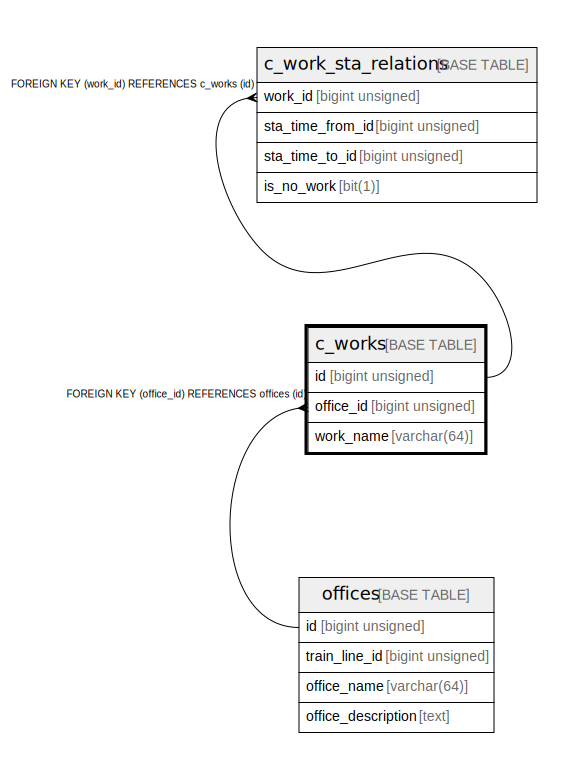

# c_works

## Description

C work (conductor works)

<details>
<summary><strong>Table Definition</strong></summary>

```sql
CREATE TABLE `c_works` (
  `id` bigint unsigned NOT NULL AUTO_INCREMENT COMMENT 'counter to identify each record',
  `office_id` bigint unsigned NOT NULL COMMENT 'target office id',
  `work_name` varchar(64) NOT NULL COMMENT 'work name',
  PRIMARY KEY (`id`),
  UNIQUE KEY `office_id` (`office_id`,`work_name`),
  CONSTRAINT `c_works_ibfk_1` FOREIGN KEY (`office_id`) REFERENCES `offices` (`id`) ON DELETE CASCADE
) ENGINE=InnoDB AUTO_INCREMENT=[Redacted by tbls] DEFAULT CHARSET=utf8mb4 COLLATE=utf8mb4_0900_ai_ci COMMENT='C work (conductor works)'
```

</details>

## Columns

| # | Name | Type | Default | Nullable | Extra Definition | Children | Parents | Comment |
| - | ---- | ---- | ------- | -------- | ---------------- | -------- | ------- | ------- |
| 1 | id | bigint unsigned |  | false | auto_increment | [c_work_sta_relations](c_work_sta_relations.md) |  | counter to identify each record |
| 2 | office_id | bigint unsigned |  | false |  |  | [offices](offices.md) | target office id |
| 3 | work_name | varchar(64) |  | false |  |  |  | work name |

## Constraints

| # | Name | Type | Definition |
| - | ---- | ---- | ---------- |
| 1 | c_works_ibfk_1 | FOREIGN KEY | FOREIGN KEY (office_id) REFERENCES offices (id) |
| 2 | office_id | UNIQUE | UNIQUE KEY office_id (office_id, work_name) |
| 3 | PRIMARY | PRIMARY KEY | PRIMARY KEY (id) |

## Indexes

| # | Name | Definition |
| - | ---- | ---------- |
| 1 | PRIMARY | PRIMARY KEY (id) USING BTREE |
| 2 | office_id | UNIQUE KEY office_id (office_id, work_name) USING BTREE |

## Relations



---

> Generated by [tbls](https://github.com/k1LoW/tbls)
