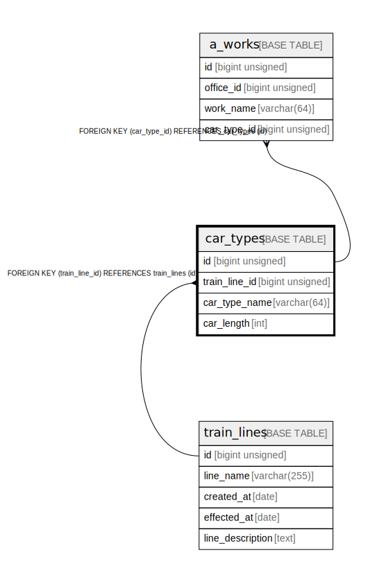

# car_types

## Description

car types (e.g. Series 0 with 16 car length)

<details>
<summary><strong>Table Definition</strong></summary>

```sql
CREATE TABLE `car_types` (
  `id` bigint unsigned NOT NULL AUTO_INCREMENT COMMENT 'counter to identify each record',
  `train_line_id` bigint unsigned NOT NULL COMMENT 'line id that has this car type',
  `car_type_name` varchar(64) NOT NULL COMMENT 'car type name',
  `car_length` int NOT NULL COMMENT 'car length',
  PRIMARY KEY (`id`),
  UNIQUE KEY `train_line_id` (`train_line_id`,`car_type_name`),
  CONSTRAINT `car_types_ibfk_1` FOREIGN KEY (`train_line_id`) REFERENCES `train_lines` (`id`) ON DELETE CASCADE
) ENGINE=InnoDB AUTO_INCREMENT=[Redacted by tbls] DEFAULT CHARSET=utf8mb4 COLLATE=utf8mb4_0900_ai_ci COMMENT='car types (e.g. Series 0 with 16 car length)'
```

</details>

## Columns

| # | Name | Type | Default | Nullable | Extra Definition | Children | Parents | Comment |
| - | ---- | ---- | ------- | -------- | ---------------- | -------- | ------- | ------- |
| 1 | id | bigint unsigned |  | false | auto_increment | [a_works](a_works.md) |  | counter to identify each record |
| 2 | train_line_id | bigint unsigned |  | false |  |  | [train_lines](train_lines.md) | line id that has this car type |
| 3 | car_type_name | varchar(64) |  | false |  |  |  | car type name |
| 4 | car_length | int |  | false |  |  |  | car length |

## Constraints

| # | Name | Type | Definition |
| - | ---- | ---- | ---------- |
| 1 | car_types_ibfk_1 | FOREIGN KEY | FOREIGN KEY (train_line_id) REFERENCES train_lines (id) |
| 2 | PRIMARY | PRIMARY KEY | PRIMARY KEY (id) |
| 3 | train_line_id | UNIQUE | UNIQUE KEY train_line_id (train_line_id, car_type_name) |

## Indexes

| # | Name | Definition |
| - | ---- | ---------- |
| 1 | PRIMARY | PRIMARY KEY (id) USING BTREE |
| 2 | train_line_id | UNIQUE KEY train_line_id (train_line_id, car_type_name) USING BTREE |

## Relations



---

> Generated by [tbls](https://github.com/k1LoW/tbls)
