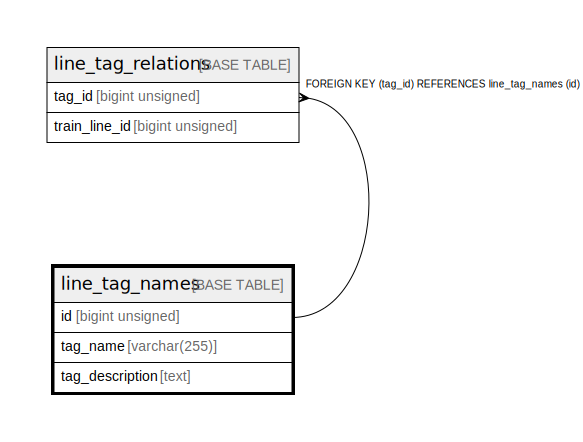

# line_tag_names

## Description

line tag name and descriptions

<details>
<summary><strong>Table Definition</strong></summary>

```sql
CREATE TABLE `line_tag_names` (
  `id` bigint unsigned NOT NULL AUTO_INCREMENT COMMENT 'counter to identify each record',
  `tag_name` varchar(255) NOT NULL COMMENT 'tag name to be displayed',
  `tag_description` text COMMENT 'tag description',
  PRIMARY KEY (`id`)
) ENGINE=InnoDB AUTO_INCREMENT=[Redacted by tbls] DEFAULT CHARSET=utf8mb4 COLLATE=utf8mb4_0900_ai_ci COMMENT='line tag name and descriptions'
```

</details>

## Columns

| # | Name | Type | Default | Nullable | Extra Definition | Children | Parents | Comment |
| - | ---- | ---- | ------- | -------- | ---------------- | -------- | ------- | ------- |
| 1 | id | bigint unsigned |  | false | auto_increment | [line_tag_relations](line_tag_relations.md) |  | counter to identify each record |
| 2 | tag_name | varchar(255) |  | false |  |  |  | tag name to be displayed |
| 3 | tag_description | text |  | true |  |  |  | tag description |

## Constraints

| # | Name | Type | Definition |
| - | ---- | ---- | ---------- |
| 1 | PRIMARY | PRIMARY KEY | PRIMARY KEY (id) |

## Indexes

| # | Name | Definition |
| - | ---- | ---------- |
| 1 | PRIMARY | PRIMARY KEY (id) USING BTREE |

## Relations



---

> Generated by [tbls](https://github.com/k1LoW/tbls)
