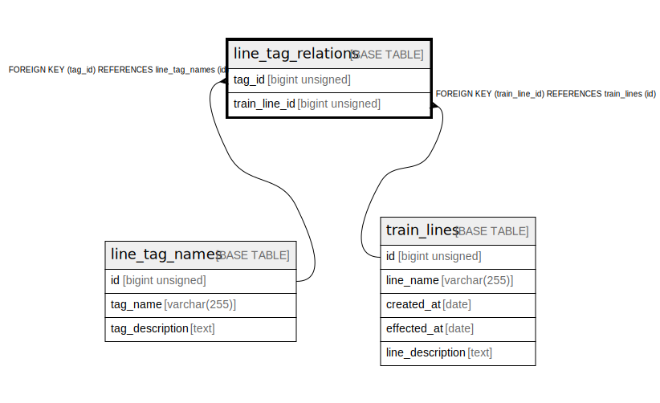

# line_tag_relations

## Description

relations between line and tag

<details>
<summary><strong>Table Definition</strong></summary>

```sql
CREATE TABLE `line_tag_relations` (
  `tag_id` bigint unsigned NOT NULL COMMENT 'tag id to set to line data',
  `train_line_id` bigint unsigned NOT NULL COMMENT 'line id to set the tag',
  PRIMARY KEY (`tag_id`,`train_line_id`),
  KEY `train_line_id` (`train_line_id`),
  CONSTRAINT `line_tag_relations_ibfk_1` FOREIGN KEY (`tag_id`) REFERENCES `line_tag_names` (`id`) ON DELETE CASCADE,
  CONSTRAINT `line_tag_relations_ibfk_2` FOREIGN KEY (`train_line_id`) REFERENCES `train_lines` (`id`) ON DELETE CASCADE
) ENGINE=InnoDB DEFAULT CHARSET=utf8mb4 COLLATE=utf8mb4_0900_ai_ci COMMENT='relations between line and tag'
```

</details>

## Columns

| # | Name | Type | Default | Nullable | Children | Parents | Comment |
| - | ---- | ---- | ------- | -------- | -------- | ------- | ------- |
| 1 | tag_id | bigint unsigned |  | false |  | [line_tag_names](line_tag_names.md) | tag id to set to line data |
| 2 | train_line_id | bigint unsigned |  | false |  | [train_lines](train_lines.md) | line id to set the tag |

## Constraints

| # | Name | Type | Definition |
| - | ---- | ---- | ---------- |
| 1 | line_tag_relations_ibfk_1 | FOREIGN KEY | FOREIGN KEY (tag_id) REFERENCES line_tag_names (id) |
| 2 | line_tag_relations_ibfk_2 | FOREIGN KEY | FOREIGN KEY (train_line_id) REFERENCES train_lines (id) |
| 3 | PRIMARY | PRIMARY KEY | PRIMARY KEY (tag_id, train_line_id) |

## Indexes

| # | Name | Definition |
| - | ---- | ---------- |
| 1 | train_line_id | KEY train_line_id (train_line_id) USING BTREE |
| 2 | PRIMARY | PRIMARY KEY (tag_id, train_line_id) USING BTREE |

## Relations



---

> Generated by [tbls](https://github.com/k1LoW/tbls)
