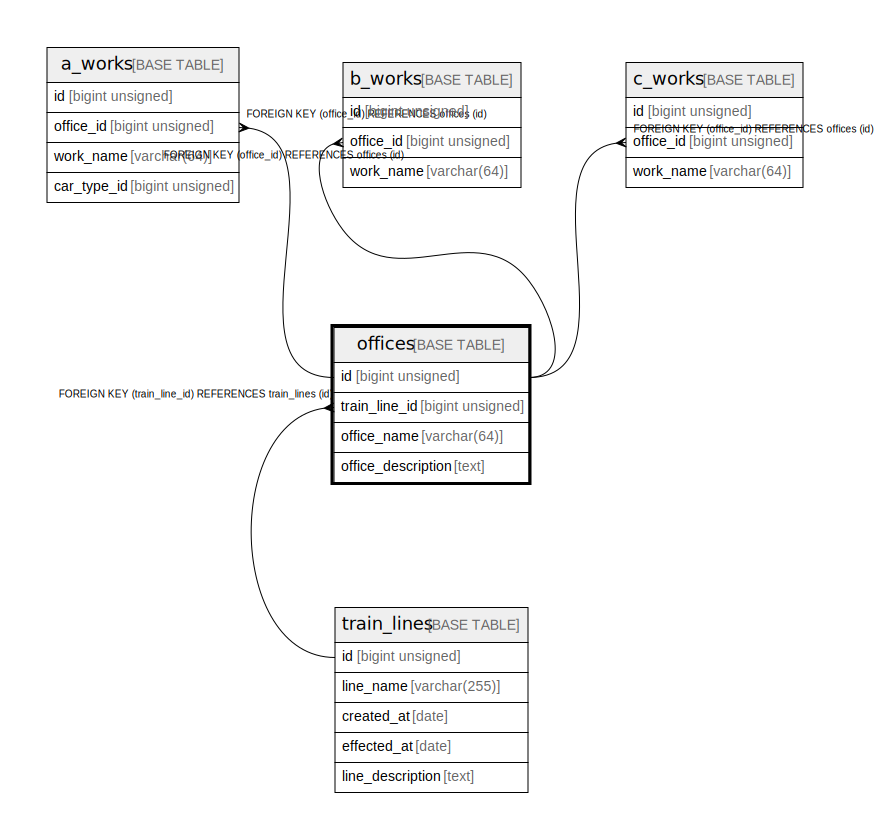

# offices

## Description

train/work etc. office informations

<details>
<summary><strong>Table Definition</strong></summary>

```sql
CREATE TABLE `offices` (
  `id` bigint unsigned NOT NULL AUTO_INCREMENT COMMENT 'counter to identify each record',
  `train_line_id` bigint unsigned NOT NULL COMMENT 'line id that has this office',
  `office_name` varchar(64) NOT NULL COMMENT 'name of this office',
  `office_description` text COMMENT 'office description (address, capacity, etc.)',
  PRIMARY KEY (`id`),
  UNIQUE KEY `train_line_id` (`train_line_id`,`office_name`),
  CONSTRAINT `offices_ibfk_1` FOREIGN KEY (`train_line_id`) REFERENCES `train_lines` (`id`) ON DELETE CASCADE
) ENGINE=InnoDB AUTO_INCREMENT=[Redacted by tbls] DEFAULT CHARSET=utf8mb4 COLLATE=utf8mb4_0900_ai_ci COMMENT='train/work etc. office informations'
```

</details>

## Columns

| # | Name | Type | Default | Nullable | Extra Definition | Children | Parents | Comment |
| - | ---- | ---- | ------- | -------- | ---------------- | -------- | ------- | ------- |
| 1 | id | bigint unsigned |  | false | auto_increment | [a_works](a_works.md) [b_works](b_works.md) [c_works](c_works.md) |  | counter to identify each record |
| 2 | train_line_id | bigint unsigned |  | false |  |  | [train_lines](train_lines.md) | line id that has this office |
| 3 | office_name | varchar(64) |  | false |  |  |  | name of this office |
| 4 | office_description | text |  | true |  |  |  | office description (address, capacity, etc.) |

## Constraints

| # | Name | Type | Definition |
| - | ---- | ---- | ---------- |
| 1 | offices_ibfk_1 | FOREIGN KEY | FOREIGN KEY (train_line_id) REFERENCES train_lines (id) |
| 2 | PRIMARY | PRIMARY KEY | PRIMARY KEY (id) |
| 3 | train_line_id | UNIQUE | UNIQUE KEY train_line_id (train_line_id, office_name) |

## Indexes

| # | Name | Definition |
| - | ---- | ---------- |
| 1 | PRIMARY | PRIMARY KEY (id) USING BTREE |
| 2 | train_line_id | UNIQUE KEY train_line_id (train_line_id, office_name) USING BTREE |

## Relations



---

> Generated by [tbls](https://github.com/k1LoW/tbls)
