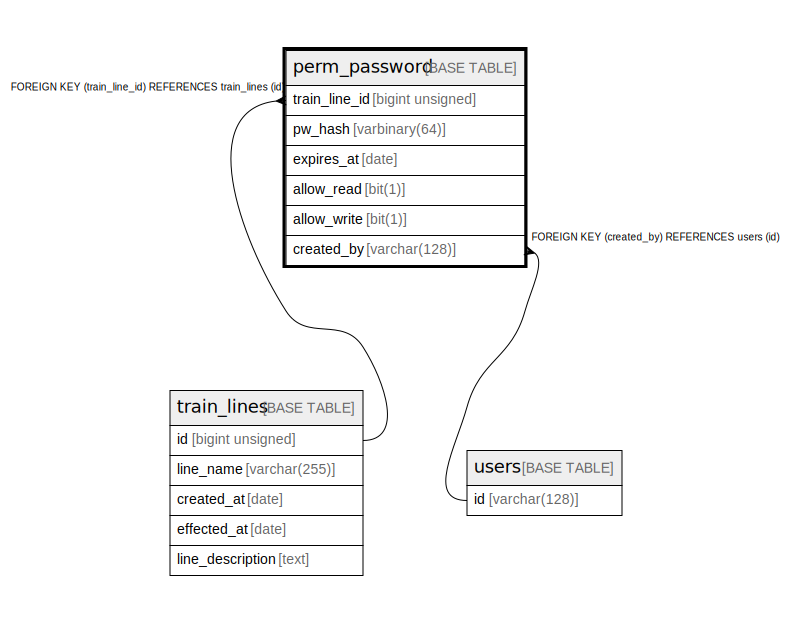

# perm_password

## Description

hashed password list for adding new accessible users

<details>
<summary><strong>Table Definition</strong></summary>

```sql
CREATE TABLE `perm_password` (
  `train_line_id` bigint unsigned NOT NULL COMMENT 'target line id',
  `pw_hash` varbinary(64) NOT NULL COMMENT 'password hash (expected hash algorithm: SHA512)',
  `expires_at` date NOT NULL COMMENT 'expire date of this record',
  `allow_read` bit(1) NOT NULL COMMENT 'whether allow to READ with this password',
  `allow_write` bit(1) NOT NULL COMMENT 'whether allow to WRITE with this password',
  `created_by` varchar(128) NOT NULL COMMENT 'creator of this record (only this user can delete this record)',
  PRIMARY KEY (`train_line_id`,`pw_hash`,`expires_at`),
  KEY `created_by` (`created_by`),
  CONSTRAINT `perm_password_ibfk_1` FOREIGN KEY (`train_line_id`) REFERENCES `train_lines` (`id`) ON DELETE CASCADE,
  CONSTRAINT `perm_password_ibfk_2` FOREIGN KEY (`created_by`) REFERENCES `users` (`id`),
  CONSTRAINT `perm_password_chk_1` CHECK ((`expires_at` > _latin1'2020-01-01'))
) ENGINE=InnoDB DEFAULT CHARSET=utf8mb3 COMMENT='hashed password list for adding new accessible users'
```

</details>

## Columns

| # | Name | Type | Default | Nullable | Children | Parents | Comment |
| - | ---- | ---- | ------- | -------- | -------- | ------- | ------- |
| 1 | train_line_id | bigint unsigned |  | false |  | [train_lines](train_lines.md) | target line id |
| 2 | pw_hash | varbinary(64) |  | false |  |  | password hash (expected hash algorithm: SHA512) |
| 3 | expires_at | date |  | false |  |  | expire date of this record |
| 4 | allow_read | bit(1) |  | false |  |  | whether allow to READ with this password |
| 5 | allow_write | bit(1) |  | false |  |  | whether allow to WRITE with this password |
| 6 | created_by | varchar(128) |  | false |  | [users](users.md) | creator of this record (only this user can delete this record) |

## Constraints

| # | Name | Type | Definition |
| - | ---- | ---- | ---------- |
| 1 | perm_password_ibfk_1 | FOREIGN KEY | FOREIGN KEY (train_line_id) REFERENCES train_lines (id) |
| 2 | perm_password_ibfk_2 | FOREIGN KEY | FOREIGN KEY (created_by) REFERENCES users (id) |
| 3 | PRIMARY | PRIMARY KEY | PRIMARY KEY (train_line_id, pw_hash, expires_at) |

## Indexes

| # | Name | Definition |
| - | ---- | ---------- |
| 1 | created_by | KEY created_by (created_by) USING BTREE |
| 2 | PRIMARY | PRIMARY KEY (train_line_id, pw_hash, expires_at) USING BTREE |

## Relations



---

> Generated by [tbls](https://github.com/k1LoW/tbls)
