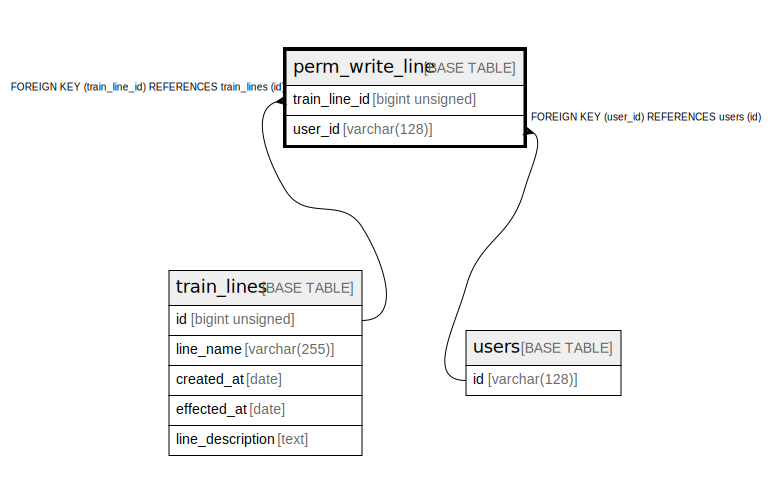

# perm_write_line

## Description

access allow users list

<details>
<summary><strong>Table Definition</strong></summary>

```sql
CREATE TABLE `perm_write_line` (
  `train_line_id` bigint unsigned NOT NULL COMMENT 'target line id',
  `user_id` varchar(128) NOT NULL COMMENT 'uid (if empty string, it means anyone can access)',
  PRIMARY KEY (`train_line_id`,`user_id`),
  KEY `user_id` (`user_id`),
  CONSTRAINT `perm_write_line_ibfk_1` FOREIGN KEY (`train_line_id`) REFERENCES `train_lines` (`id`) ON DELETE CASCADE,
  CONSTRAINT `perm_write_line_ibfk_2` FOREIGN KEY (`user_id`) REFERENCES `users` (`id`) ON DELETE CASCADE
) ENGINE=InnoDB DEFAULT CHARSET=utf8mb3 COMMENT='access allow users list'
```

</details>

## Columns

| # | Name | Type | Default | Nullable | Children | Parents | Comment |
| - | ---- | ---- | ------- | -------- | -------- | ------- | ------- |
| 1 | train_line_id | bigint unsigned |  | false |  | [train_lines](train_lines.md) | target line id |
| 2 | user_id | varchar(128) |  | false |  | [users](users.md) | uid (if empty string, it means anyone can access) |

## Constraints

| # | Name | Type | Definition |
| - | ---- | ---- | ---------- |
| 1 | perm_write_line_ibfk_1 | FOREIGN KEY | FOREIGN KEY (train_line_id) REFERENCES train_lines (id) |
| 2 | perm_write_line_ibfk_2 | FOREIGN KEY | FOREIGN KEY (user_id) REFERENCES users (id) |
| 3 | PRIMARY | PRIMARY KEY | PRIMARY KEY (train_line_id, user_id) |

## Indexes

| # | Name | Definition |
| - | ---- | ---------- |
| 1 | user_id | KEY user_id (user_id) USING BTREE |
| 2 | PRIMARY | PRIMARY KEY (train_line_id, user_id) USING BTREE |

## Relations



---

> Generated by [tbls](https://github.com/k1LoW/tbls)
