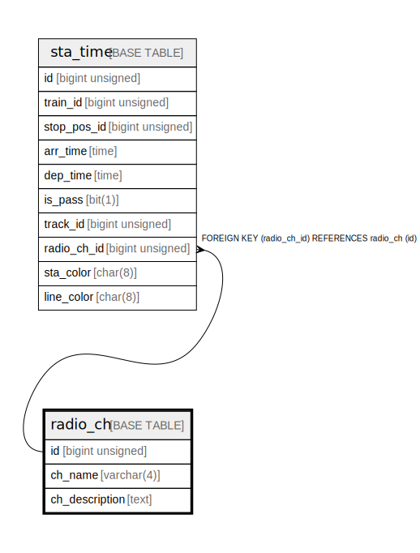

# radio_ch

## Description

Radio channel settings

<details>
<summary><strong>Table Definition</strong></summary>

```sql
CREATE TABLE `radio_ch` (
  `id` bigint unsigned NOT NULL AUTO_INCREMENT COMMENT 'counter to identify each record',
  `ch_name` varchar(4) NOT NULL COMMENT 'Radio channel text to be displayed',
  `ch_description` text COMMENT 'Radio channel description',
  PRIMARY KEY (`id`),
  UNIQUE KEY `ch_name` (`ch_name`)
) ENGINE=InnoDB AUTO_INCREMENT=[Redacted by tbls] DEFAULT CHARSET=utf8mb3 COMMENT='Radio channel settings'
```

</details>

## Columns

| # | Name | Type | Default | Nullable | Extra Definition | Children | Parents | Comment |
| - | ---- | ---- | ------- | -------- | ---------------- | -------- | ------- | ------- |
| 1 | id | bigint unsigned |  | false | auto_increment | [sta_time](sta_time.md) |  | counter to identify each record |
| 2 | ch_name | varchar(4) |  | false |  |  |  | Radio channel text to be displayed |
| 3 | ch_description | text |  | true |  |  |  | Radio channel description |

## Constraints

| # | Name | Type | Definition |
| - | ---- | ---- | ---------- |
| 1 | ch_name | UNIQUE | UNIQUE KEY ch_name (ch_name) |
| 2 | PRIMARY | PRIMARY KEY | PRIMARY KEY (id) |

## Indexes

| # | Name | Definition |
| - | ---- | ---------- |
| 1 | PRIMARY | PRIMARY KEY (id) USING BTREE |
| 2 | ch_name | UNIQUE KEY ch_name (ch_name) USING BTREE |

## Relations



---

> Generated by [tbls](https://github.com/k1LoW/tbls)
