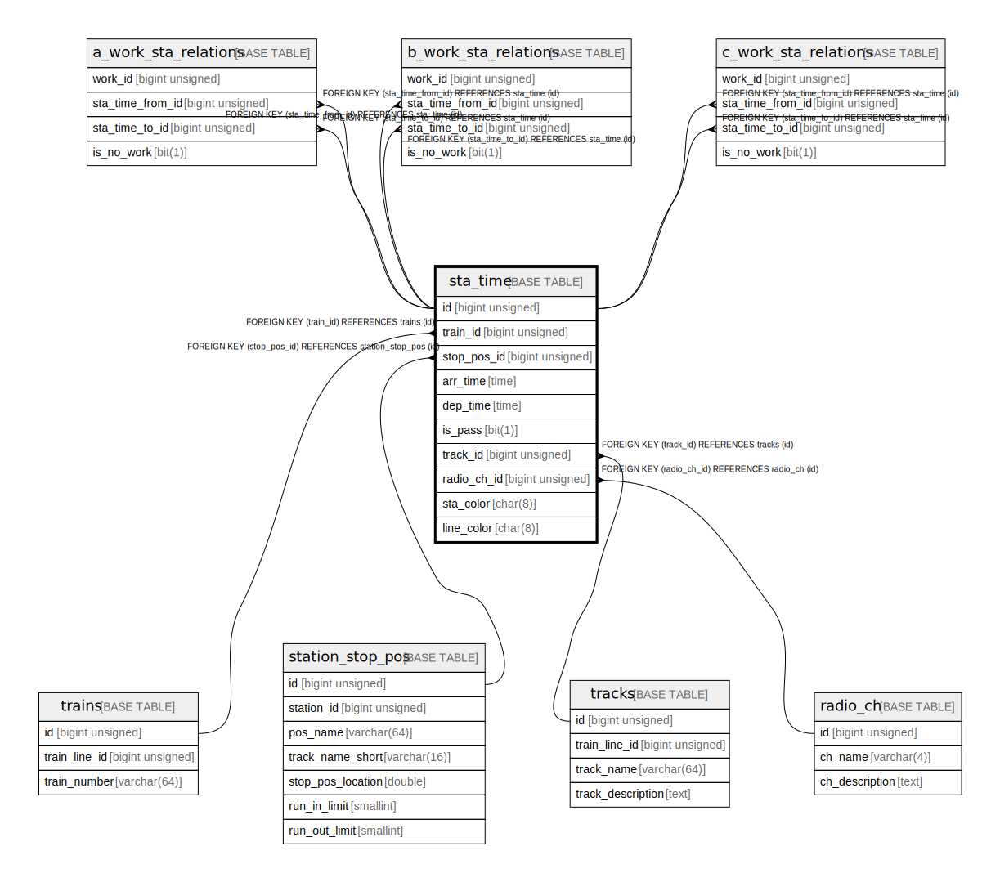

# sta_time

## Description

station arrive/departure time etc.

<details>
<summary><strong>Table Definition</strong></summary>

```sql
CREATE TABLE `sta_time` (
  `id` bigint unsigned NOT NULL AUTO_INCREMENT COMMENT 'counter to identify each record',
  `train_id` bigint unsigned NOT NULL COMMENT 'target train record id',
  `stop_pos_id` bigint unsigned NOT NULL COMMENT 'stop position id',
  `arr_time` time DEFAULT NULL COMMENT 'arrive time (if NULL and set as stop station, the time will not be displayed) the value must be same or more than 0:00:00. And normally, it will be less than 28:00:00',
  `dep_time` time DEFAULT NULL COMMENT 'departure time (if NULL and set as stop station, the time will not be displayed) the value must be same or more than 0:00:00. And normally, it will be less than 28:00:00',
  `is_pass` bit(1) NOT NULL COMMENT 'whether passing this station',
  `track_id` bigint unsigned NOT NULL COMMENT 'track id that will run on to next station',
  `radio_ch_id` bigint unsigned NOT NULL COMMENT 'radio ch id that will use to next station',
  `sta_color` char(8) NOT NULL COMMENT 'station char display color',
  `line_color` char(8) NOT NULL COMMENT 'line color that will be displayed until next station',
  PRIMARY KEY (`id`),
  UNIQUE KEY `train_id` (`train_id`,`stop_pos_id`),
  KEY `stop_pos_id` (`stop_pos_id`),
  KEY `track_id` (`track_id`),
  KEY `radio_ch_id` (`radio_ch_id`),
  CONSTRAINT `sta_time_ibfk_1` FOREIGN KEY (`train_id`) REFERENCES `trains` (`id`) ON DELETE CASCADE,
  CONSTRAINT `sta_time_ibfk_2` FOREIGN KEY (`stop_pos_id`) REFERENCES `station_stop_pos` (`id`),
  CONSTRAINT `sta_time_ibfk_3` FOREIGN KEY (`track_id`) REFERENCES `tracks` (`id`),
  CONSTRAINT `sta_time_ibfk_4` FOREIGN KEY (`radio_ch_id`) REFERENCES `radio_ch` (`id`),
  CONSTRAINT `sta_time_chk_1` CHECK ((`arr_time` >= _latin1'00:00:00')),
  CONSTRAINT `sta_time_chk_2` CHECK ((`dep_time` >= _latin1'00:00:00'))
) ENGINE=InnoDB AUTO_INCREMENT=[Redacted by tbls] DEFAULT CHARSET=utf8mb4 COLLATE=utf8mb4_0900_ai_ci COMMENT='station arrive/departure time etc.'
```

</details>

## Columns

| # | Name | Type | Default | Nullable | Extra Definition | Children | Parents | Comment |
| - | ---- | ---- | ------- | -------- | ---------------- | -------- | ------- | ------- |
| 1 | id | bigint unsigned |  | false | auto_increment | [a_work_sta_relations](a_work_sta_relations.md) [b_work_sta_relations](b_work_sta_relations.md) [c_work_sta_relations](c_work_sta_relations.md) |  | counter to identify each record |
| 2 | train_id | bigint unsigned |  | false |  |  | [trains](trains.md) | target train record id |
| 3 | stop_pos_id | bigint unsigned |  | false |  |  | [station_stop_pos](station_stop_pos.md) | stop position id |
| 4 | arr_time | time |  | true |  |  |  | arrive time (if NULL and set as stop station, the time will not be displayed) the value must be same or more than 0:00:00. And normally, it will be less than 28:00:00 |
| 5 | dep_time | time |  | true |  |  |  | departure time (if NULL and set as stop station, the time will not be displayed) the value must be same or more than 0:00:00. And normally, it will be less than 28:00:00 |
| 6 | is_pass | bit(1) |  | false |  |  |  | whether passing this station |
| 7 | track_id | bigint unsigned |  | false |  |  | [tracks](tracks.md) | track id that will run on to next station |
| 8 | radio_ch_id | bigint unsigned |  | false |  |  | [radio_ch](radio_ch.md) | radio ch id that will use to next station |
| 9 | sta_color | char(8) |  | false |  |  |  | station char display color |
| 10 | line_color | char(8) |  | false |  |  |  | line color that will be displayed until next station |

## Constraints

| # | Name | Type | Definition |
| - | ---- | ---- | ---------- |
| 1 | PRIMARY | PRIMARY KEY | PRIMARY KEY (id) |
| 2 | sta_time_ibfk_1 | FOREIGN KEY | FOREIGN KEY (train_id) REFERENCES trains (id) |
| 3 | sta_time_ibfk_2 | FOREIGN KEY | FOREIGN KEY (stop_pos_id) REFERENCES station_stop_pos (id) |
| 4 | sta_time_ibfk_3 | FOREIGN KEY | FOREIGN KEY (track_id) REFERENCES tracks (id) |
| 5 | sta_time_ibfk_4 | FOREIGN KEY | FOREIGN KEY (radio_ch_id) REFERENCES radio_ch (id) |
| 6 | train_id | UNIQUE | UNIQUE KEY train_id (train_id, stop_pos_id) |

## Indexes

| # | Name | Definition |
| - | ---- | ---------- |
| 1 | radio_ch_id | KEY radio_ch_id (radio_ch_id) USING BTREE |
| 2 | stop_pos_id | KEY stop_pos_id (stop_pos_id) USING BTREE |
| 3 | track_id | KEY track_id (track_id) USING BTREE |
| 4 | PRIMARY | PRIMARY KEY (id) USING BTREE |
| 5 | train_id | UNIQUE KEY train_id (train_id, stop_pos_id) USING BTREE |

## Relations



---

> Generated by [tbls](https://github.com/k1LoW/tbls)
