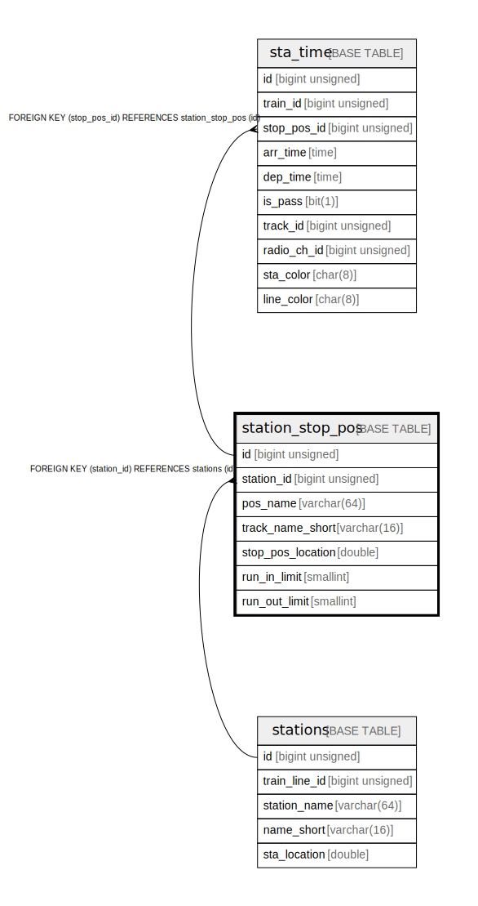

# station_stop_pos

## Description

stop position of each station

<details>
<summary><strong>Table Definition</strong></summary>

```sql
CREATE TABLE `station_stop_pos` (
  `id` bigint unsigned NOT NULL AUTO_INCREMENT COMMENT 'counter to identify each record',
  `station_id` bigint unsigned NOT NULL COMMENT 'station id that has this stop-position',
  `pos_name` varchar(64) NOT NULL COMMENT 'stop position name (full name)',
  `track_name_short` varchar(16) NOT NULL COMMENT 'stop position / track name (short name: normally, length will be same or less than 3)',
  `stop_pos_location` double NOT NULL COMMENT 'location of stop position',
  `run_in_limit` smallint DEFAULT NULL COMMENT 'run in limit [km/h]',
  `run_out_limit` smallint DEFAULT NULL COMMENT 'run out limit [km/h]',
  PRIMARY KEY (`id`),
  KEY `station_id` (`station_id`),
  CONSTRAINT `station_stop_pos_ibfk_1` FOREIGN KEY (`station_id`) REFERENCES `stations` (`id`) ON DELETE CASCADE
) ENGINE=InnoDB AUTO_INCREMENT=[Redacted by tbls] DEFAULT CHARSET=utf8mb3 COMMENT='stop position of each station'
```

</details>

## Columns

| # | Name | Type | Default | Nullable | Extra Definition | Children | Parents | Comment |
| - | ---- | ---- | ------- | -------- | ---------------- | -------- | ------- | ------- |
| 1 | id | bigint unsigned |  | false | auto_increment | [sta_time](sta_time.md) |  | counter to identify each record |
| 2 | station_id | bigint unsigned |  | false |  |  | [stations](stations.md) | station id that has this stop-position |
| 3 | pos_name | varchar(64) |  | false |  |  |  | stop position name (full name) |
| 4 | track_name_short | varchar(16) |  | false |  |  |  | stop position / track name (short name: normally, length will be same or less than 3) |
| 5 | stop_pos_location | double |  | false |  |  |  | location of stop position |
| 6 | run_in_limit | smallint |  | true |  |  |  | run in limit [km/h] |
| 7 | run_out_limit | smallint |  | true |  |  |  | run out limit [km/h] |

## Constraints

| # | Name | Type | Definition |
| - | ---- | ---- | ---------- |
| 1 | PRIMARY | PRIMARY KEY | PRIMARY KEY (id) |
| 2 | station_stop_pos_ibfk_1 | FOREIGN KEY | FOREIGN KEY (station_id) REFERENCES stations (id) |

## Indexes

| # | Name | Definition |
| - | ---- | ---------- |
| 1 | station_id | KEY station_id (station_id) USING BTREE |
| 2 | PRIMARY | PRIMARY KEY (id) USING BTREE |

## Relations



---

> Generated by [tbls](https://github.com/k1LoW/tbls)
