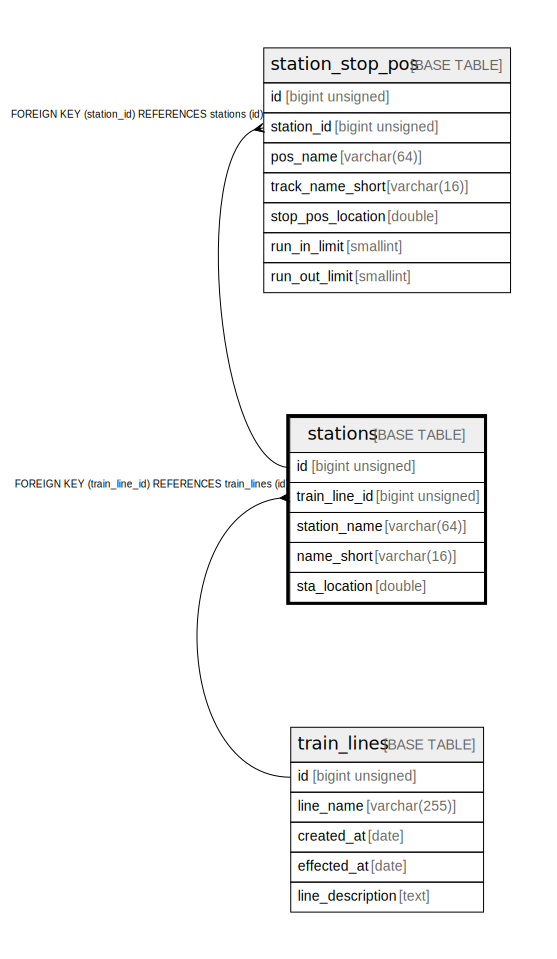

# stations

## Description

station information

<details>
<summary><strong>Table Definition</strong></summary>

```sql
CREATE TABLE `stations` (
  `id` bigint unsigned NOT NULL AUTO_INCREMENT COMMENT 'counter to identify each record',
  `train_line_id` bigint unsigned NOT NULL COMMENT 'line id that has this station',
  `station_name` varchar(64) NOT NULL COMMENT 'station name (full name)',
  `name_short` varchar(16) NOT NULL COMMENT 'station name (short name: normally, length will be same or less than 4)',
  `sta_location` double NOT NULL COMMENT 'station center location',
  PRIMARY KEY (`id`),
  UNIQUE KEY `train_line_id` (`train_line_id`,`station_name`),
  CONSTRAINT `stations_ibfk_1` FOREIGN KEY (`train_line_id`) REFERENCES `train_lines` (`id`) ON DELETE CASCADE
) ENGINE=InnoDB AUTO_INCREMENT=[Redacted by tbls] DEFAULT CHARSET=utf8mb4 COLLATE=utf8mb4_0900_ai_ci COMMENT='station information'
```

</details>

## Columns

| # | Name | Type | Default | Nullable | Extra Definition | Children | Parents | Comment |
| - | ---- | ---- | ------- | -------- | ---------------- | -------- | ------- | ------- |
| 1 | id | bigint unsigned |  | false | auto_increment | [station_stop_pos](station_stop_pos.md) |  | counter to identify each record |
| 2 | train_line_id | bigint unsigned |  | false |  |  | [train_lines](train_lines.md) | line id that has this station |
| 3 | station_name | varchar(64) |  | false |  |  |  | station name (full name) |
| 4 | name_short | varchar(16) |  | false |  |  |  | station name (short name: normally, length will be same or less than 4) |
| 5 | sta_location | double |  | false |  |  |  | station center location |

## Constraints

| # | Name | Type | Definition |
| - | ---- | ---- | ---------- |
| 1 | PRIMARY | PRIMARY KEY | PRIMARY KEY (id) |
| 2 | stations_ibfk_1 | FOREIGN KEY | FOREIGN KEY (train_line_id) REFERENCES train_lines (id) |
| 3 | train_line_id | UNIQUE | UNIQUE KEY train_line_id (train_line_id, station_name) |

## Indexes

| # | Name | Definition |
| - | ---- | ---------- |
| 1 | PRIMARY | PRIMARY KEY (id) USING BTREE |
| 2 | train_line_id | UNIQUE KEY train_line_id (train_line_id, station_name) USING BTREE |

## Relations



---

> Generated by [tbls](https://github.com/k1LoW/tbls)
