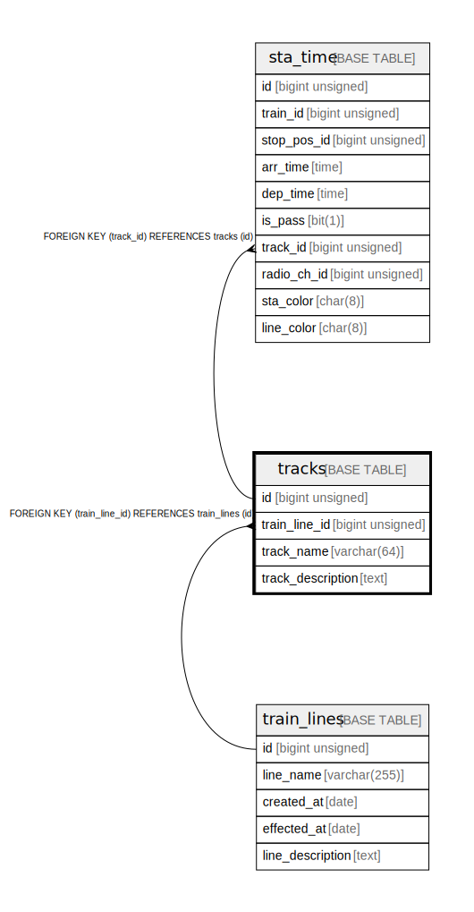

# tracks

## Description

track information (between each stations)

<details>
<summary><strong>Table Definition</strong></summary>

```sql
CREATE TABLE `tracks` (
  `id` bigint unsigned NOT NULL AUTO_INCREMENT COMMENT 'counter to identify each record',
  `train_line_id` bigint unsigned NOT NULL COMMENT 'line id that has this track',
  `track_name` varchar(64) NOT NULL COMMENT 'name of this track',
  `track_description` text COMMENT 'track description',
  PRIMARY KEY (`id`),
  UNIQUE KEY `train_line_id` (`train_line_id`,`track_name`),
  CONSTRAINT `tracks_ibfk_1` FOREIGN KEY (`train_line_id`) REFERENCES `train_lines` (`id`) ON DELETE CASCADE
) ENGINE=InnoDB AUTO_INCREMENT=[Redacted by tbls] DEFAULT CHARSET=utf8mb3 COMMENT='track information (between each stations)'
```

</details>

## Columns

| # | Name | Type | Default | Nullable | Extra Definition | Children | Parents | Comment |
| - | ---- | ---- | ------- | -------- | ---------------- | -------- | ------- | ------- |
| 1 | id | bigint unsigned |  | false | auto_increment | [sta_time](sta_time.md) |  | counter to identify each record |
| 2 | train_line_id | bigint unsigned |  | false |  |  | [train_lines](train_lines.md) | line id that has this track |
| 3 | track_name | varchar(64) |  | false |  |  |  | name of this track |
| 4 | track_description | text |  | true |  |  |  | track description |

## Constraints

| # | Name | Type | Definition |
| - | ---- | ---- | ---------- |
| 1 | PRIMARY | PRIMARY KEY | PRIMARY KEY (id) |
| 2 | tracks_ibfk_1 | FOREIGN KEY | FOREIGN KEY (train_line_id) REFERENCES train_lines (id) |
| 3 | train_line_id | UNIQUE | UNIQUE KEY train_line_id (train_line_id, track_name) |

## Indexes

| # | Name | Definition |
| - | ---- | ---------- |
| 1 | PRIMARY | PRIMARY KEY (id) USING BTREE |
| 2 | train_line_id | UNIQUE KEY train_line_id (train_line_id, track_name) USING BTREE |

## Relations



---

> Generated by [tbls](https://github.com/k1LoW/tbls)
