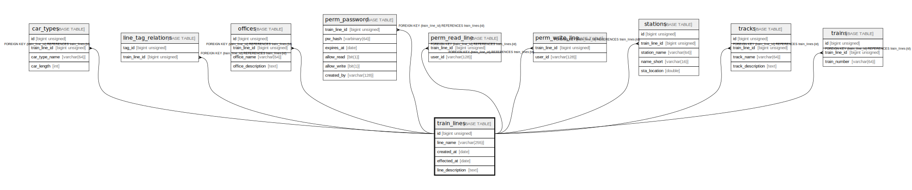

# train_lines

## Description

railroad line data

<details>
<summary><strong>Table Definition</strong></summary>

```sql
CREATE TABLE `train_lines` (
  `id` bigint unsigned NOT NULL AUTO_INCREMENT COMMENT 'counter to identify each record',
  `line_name` varchar(255) NOT NULL COMMENT 'line name',
  `created_at` date NOT NULL COMMENT 'record created date',
  `effected_at` date NOT NULL COMMENT 'data effective date',
  `line_description` text COMMENT 'line description',
  PRIMARY KEY (`id`)
) ENGINE=InnoDB AUTO_INCREMENT=[Redacted by tbls] DEFAULT CHARSET=utf8mb3 COMMENT='railroad line data'
```

</details>

## Columns

| # | Name | Type | Default | Nullable | Extra Definition | Children | Parents | Comment |
| - | ---- | ---- | ------- | -------- | ---------------- | -------- | ------- | ------- |
| 1 | id | bigint unsigned |  | false | auto_increment | [car_types](car_types.md) [line_tag_relations](line_tag_relations.md) [offices](offices.md) [perm_password](perm_password.md) [perm_read_line](perm_read_line.md) [perm_write_line](perm_write_line.md) [stations](stations.md) [tracks](tracks.md) [trains](trains.md) |  | counter to identify each record |
| 2 | line_name | varchar(255) |  | false |  |  |  | line name |
| 3 | created_at | date |  | false |  |  |  | record created date |
| 4 | effected_at | date |  | false |  |  |  | data effective date |
| 5 | line_description | text |  | true |  |  |  | line description |

## Constraints

| # | Name | Type | Definition |
| - | ---- | ---- | ---------- |
| 1 | PRIMARY | PRIMARY KEY | PRIMARY KEY (id) |

## Indexes

| # | Name | Definition |
| - | ---- | ---------- |
| 1 | PRIMARY | PRIMARY KEY (id) USING BTREE |

## Relations



---

> Generated by [tbls](https://github.com/k1LoW/tbls)
