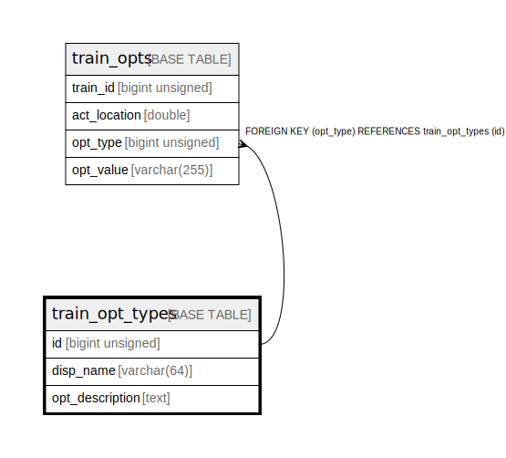

# train_opt_types

## Description

option types for train data

<details>
<summary><strong>Table Definition</strong></summary>

```sql
CREATE TABLE `train_opt_types` (
  `id` bigint unsigned NOT NULL AUTO_INCREMENT COMMENT 'counter to identify each record',
  `disp_name` varchar(64) NOT NULL COMMENT 'option name',
  `opt_description` text COMMENT 'option description',
  PRIMARY KEY (`id`),
  UNIQUE KEY `disp_name` (`disp_name`)
) ENGINE=InnoDB AUTO_INCREMENT=[Redacted by tbls] DEFAULT CHARSET=utf8mb3 COMMENT='option types for train data'
```

</details>

## Columns

| # | Name | Type | Default | Nullable | Extra Definition | Children | Parents | Comment |
| - | ---- | ---- | ------- | -------- | ---------------- | -------- | ------- | ------- |
| 1 | id | bigint unsigned |  | false | auto_increment | [train_opts](train_opts.md) |  | counter to identify each record |
| 2 | disp_name | varchar(64) |  | false |  |  |  | option name |
| 3 | opt_description | text |  | true |  |  |  | option description |

## Constraints

| # | Name | Type | Definition |
| - | ---- | ---- | ---------- |
| 1 | disp_name | UNIQUE | UNIQUE KEY disp_name (disp_name) |
| 2 | PRIMARY | PRIMARY KEY | PRIMARY KEY (id) |

## Indexes

| # | Name | Definition |
| - | ---- | ---------- |
| 1 | PRIMARY | PRIMARY KEY (id) USING BTREE |
| 2 | disp_name | UNIQUE KEY disp_name (disp_name) USING BTREE |

## Relations



---

> Generated by [tbls](https://github.com/k1LoW/tbls)
