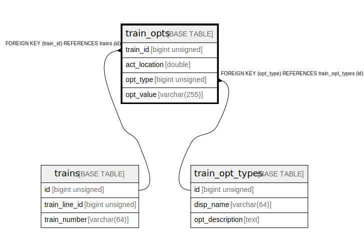

# train_opts

## Description

options for train data

<details>
<summary><strong>Table Definition</strong></summary>

```sql
CREATE TABLE `train_opts` (
  `train_id` bigint unsigned NOT NULL COMMENT 'target train id',
  `act_location` double NOT NULL COMMENT 'location that will be effected this option',
  `opt_type` bigint unsigned NOT NULL COMMENT 'option type id',
  `opt_value` varchar(255) NOT NULL COMMENT 'option setting value',
  PRIMARY KEY (`train_id`,`act_location`,`opt_type`),
  KEY `opt_type` (`opt_type`),
  CONSTRAINT `train_opts_ibfk_1` FOREIGN KEY (`train_id`) REFERENCES `trains` (`id`) ON DELETE CASCADE,
  CONSTRAINT `train_opts_ibfk_2` FOREIGN KEY (`opt_type`) REFERENCES `train_opt_types` (`id`) ON DELETE CASCADE
) ENGINE=InnoDB DEFAULT CHARSET=utf8mb4 COLLATE=utf8mb4_0900_ai_ci COMMENT='options for train data'
```

</details>

## Columns

| # | Name | Type | Default | Nullable | Children | Parents | Comment |
| - | ---- | ---- | ------- | -------- | -------- | ------- | ------- |
| 1 | train_id | bigint unsigned |  | false |  | [trains](trains.md) | target train id |
| 2 | act_location | double |  | false |  |  | location that will be effected this option |
| 3 | opt_type | bigint unsigned |  | false |  | [train_opt_types](train_opt_types.md) | option type id |
| 4 | opt_value | varchar(255) |  | false |  |  | option setting value |

## Constraints

| # | Name | Type | Definition |
| - | ---- | ---- | ---------- |
| 1 | PRIMARY | PRIMARY KEY | PRIMARY KEY (train_id, act_location, opt_type) |
| 2 | train_opts_ibfk_1 | FOREIGN KEY | FOREIGN KEY (train_id) REFERENCES trains (id) |
| 3 | train_opts_ibfk_2 | FOREIGN KEY | FOREIGN KEY (opt_type) REFERENCES train_opt_types (id) |

## Indexes

| # | Name | Definition |
| - | ---- | ---------- |
| 1 | opt_type | KEY opt_type (opt_type) USING BTREE |
| 2 | PRIMARY | PRIMARY KEY (train_id, act_location, opt_type) USING BTREE |

## Relations



---

> Generated by [tbls](https://github.com/k1LoW/tbls)
