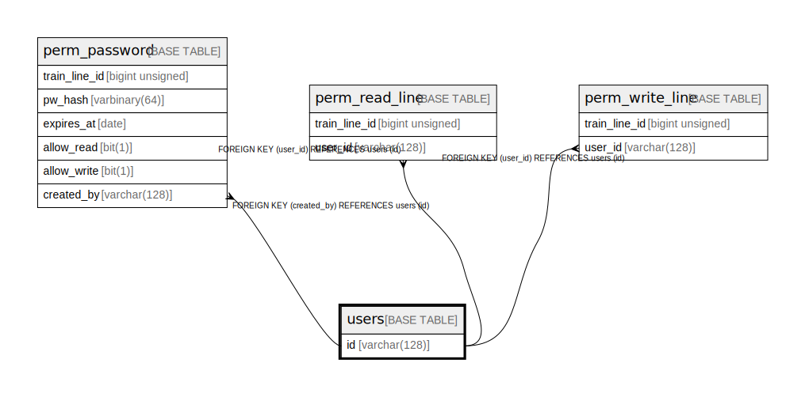

# users

## Description

Records User IDs (uid) created by Firebase Authentication

<details>
<summary><strong>Table Definition</strong></summary>

```sql
CREATE TABLE `users` (
  `id` varchar(128) NOT NULL COMMENT 'User ID (uid) created by Firebase Authentication',
  PRIMARY KEY (`id`)
) ENGINE=InnoDB DEFAULT CHARSET=utf8mb4 COLLATE=utf8mb4_0900_ai_ci COMMENT='Records User IDs (uid) created by Firebase Authentication'
```

</details>

## Columns

| # | Name | Type | Default | Nullable | Children | Parents | Comment |
| - | ---- | ---- | ------- | -------- | -------- | ------- | ------- |
| 1 | id | varchar(128) |  | false | [perm_password](perm_password.md) [perm_read_line](perm_read_line.md) [perm_write_line](perm_write_line.md) |  | User ID (uid) created by Firebase Authentication |

## Constraints

| # | Name | Type | Definition |
| - | ---- | ---- | ---------- |
| 1 | PRIMARY | PRIMARY KEY | PRIMARY KEY (id) |

## Indexes

| # | Name | Definition |
| - | ---- | ---------- |
| 1 | PRIMARY | PRIMARY KEY (id) USING BTREE |

## Relations



---

> Generated by [tbls](https://github.com/k1LoW/tbls)
